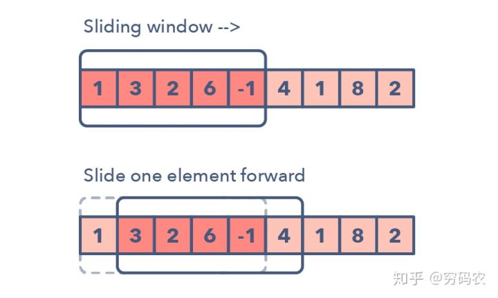
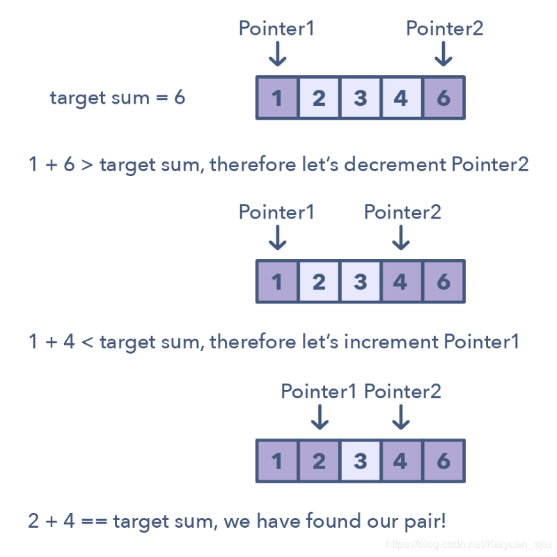

# 算法题目求解方法的 14 种模式

[TOC]

---

## 1. Pattern: Sliding window，滑动窗口类型

滑动窗口类型的题目经常是用来执行数组或是链表上某个区间（窗口）上的操作。比如找最长的全为 1 的子数组长度。滑动窗口一般从第一个元素开始，一直往右边一个一个元素挪动。当然了，根据题目要求，我们可能有固定窗口大小的情况，也有窗口的大小变化的情况。

下面是一些我们用来判断我们可能需要上滑动窗口策略的方法：

这个问题的输入是一些线性结构：比如链表呀，数组啊，字符串啊之类的
让你去求最长/最短子字符串或是某些特定的长度要求

**经典题目**：

#### 面试题 59 - I. 滑动窗口的最大值

使用一个大顶堆来表示当前的滑动窗口，大顶堆里面存储的是数字数值以及下标。

#### 76. 最小覆盖子串

这道题给了我们一个原字符串 S，还有一个目标字符串 T，让在 S 中找到一个最短的子串，使得其包含了 T 中的所有的字母，并且限制了时间复杂度为 O(n)。这道题的要求是要在 O(n) 的时间度里实现找到这个最小窗口字串，暴力搜索 Brute Force 肯定是不能用的，因为遍历所有的子串的时间复杂度是平方级的。那么来想一下，时间复杂度卡的这么严，说明必须在一次遍历中完成任务，当然遍历若干次也是 O(n)，但不一定有这个必要，尝试就一次遍历拿下！那么再来想，既然要包含 T 中所有的字母，那么对于 T 中的每个字母，肯定要快速查找是否在子串中，既然总时间都卡在了 O(n)，肯定不想在这里还浪费时间，就用空间换时间（也就算法题中可以这么干了，七老八十的富翁就算用大别野也换不来时间啊。依依东望，望的就是时间呐 T.T），使用 HashMap，建立 T 中每个字母与其出现次数之间的映射，那么你可能会有疑问，为啥不用 HashSet 呢，别急，讲到后面你就知道用 HashMap 有多妙，简直妙不可言～

目前在脑子一片浆糊的情况下，我们还是从简单的例子来分析吧，题目例子中的 S 有点长，换个短的 S = "ADBANC"，T = "ABC"，那么肉眼遍历一遍 S 呗，首先第一个是 A，嗯很好，T 中有，第二个是 D，T 中没有，不理它，第三个是 B，嗯很好，T 中有，第四个又是 A，多了一个，礼多人不怪嘛，收下啦，第五个是 N，一边凉快去，第六个终于是 C 了，那么貌似好像需要整个 S 串，其实不然，注意之前有多一个 A，就算去掉第一个 A，也没事，因为第四个 A 可以代替之，第二个 D 也可以去掉，因为不在 T 串中，第三个 B 就不能再去掉了，不然就没有 B 了。所以最终的答案就"BANC"了。通过上面的描述，你有没有发现一个有趣的现象，先扩展，再收缩，就好像一个窗口一样，先扩大右边界，然后再收缩左边界，上面的例子中右边界无法扩大了后才开始收缩左边界，实际上对于复杂的例子，有可能是扩大右边界，然后缩小一下左边界，然后再扩大右边界等等。这就很像一个不停滑动的窗口了，这就是大名鼎鼎的滑动窗口 Sliding Window 了，简直是神器啊，能解很多子串，子数组，子序列等等的问题，是必须要熟练掌握的啊！

下面来考虑用代码来实现，先来回答一下前面埋下的伏笔，为啥要用 HashMap，而不是 HashSet，现在应该很显而易见了吧，因为要统计 T 串中字母的个数，而不是仅仅看某个字母是否在 T 串中出现。统计好 T 串中字母的个数了之后，开始遍历 S 串，对于 S 中的每个遍历到的字母，都在 HashMap 中的映射值减 1，如果减 1 后的映射值仍大于等于 0，说明当前遍历到的字母是 T 串中的字母，使用一个计数器 cnt，使其自增 1。当 cnt 和 T 串字母个数相等时，说明此时的窗口已经包含了 T 串中的所有字母，此时更新一个 minLen 和结果 res，这里的 minLen 是一个全局变量，用来记录出现过的包含 T 串所有字母的最短的子串的长度，结果 res 就是这个最短的子串。然后开始收缩左边界，由于遍历的时候，对映射值减了 1，所以此时去除字母的时候，就要把减去的 1 加回来，此时如果加 1 后的值大于 0 了，说明此时少了一个 T 中的字母，那么 cnt 值就要减 1 了，然后移动左边界 left。你可能会疑问，对于不在 T 串中的字母的映射值也这么加呀减呀的，真的大丈夫（带胶布）吗？其实没啥事，因为对于不在 T 串中的字母，减 1 后，变-1，cnt 不会增加，之后收缩左边界的时候，映射值加 1 后为 0，cnt 也不会减少，所以并没有什么影响啦，下面是具体的步骤啦：

- 先扫描一遍 T，把对应的字符及其出现的次数存到 HashMap 中。

- 然后开始遍历 S，就把遍历到的字母对应的 HashMap 中的 value 减一，如果减 1 后仍大于等于 0，cnt 自增 1。

- 如果 cnt 等于 T 串长度时，开始循环，纪录一个字串并更新最小字串值。然后将子窗口的左边界向右移，如果某个移除掉的字母是 T 串中不可缺少的字母，那么 cnt 自减 1，表示此时 T 串并没有完全匹配。

更优化的方法：

这道题也可以不用 HashMap，直接用个 int 的数组来代替，因为 ASCII 只有 256 个字符，所以用个大小为 256 的 int 数组即可代替 HashMap，但由于一般输入字母串的字符只有 128 个，所以也可以只用 128，其余部分的思路完全相同，虽然只改了一个数据结构，但是运行速度提高了一倍，说明数组还是比 HashMap 快啊。在热心网友 chAngelts 的提醒下，还可以进一步的优化，没有必要每次都计算子串，只要有了起始位置和长度，就能唯一的确定一个子串。这里使用一个全局变量 minLeft 来记录最终结果子串的起始位置，初始化为 -1，最终配合上 minLen，就可以得到最终结果了。注意在返回的时候要检测一下若 minLeft 仍为初始值 -1，需返回空串

#### 992. K 个不同整数的子数组

滑动窗口。

这道题目也是使用滑动窗口可以进行解决。

核心思想就是窗口右边界开拓，遇到限制条件了之后，那么开始收缩左边界。

使用两个关键变量：ans 最后的计数个数，cnt 滑动窗口里面不同数字的个数。

而且使用一个 hashmap 或者固定数组来计数，确定好计数条件来表示什么时候是新数字，什么时候不是新数字，以此区分来影响对 cnt 的效果。

这道题目和题目 76 很像。

#### 480. 滑动窗口中位数

使用滑动窗口和大小堆实现。

大小堆使用 multiset 实现起来比较方便，因为相比于 priority_queue, multiset 实现的大小堆可以访问中间的数字，而且可以查找中间的数字，而且可以遍历数字，因为其中的数字顺序都是有序的，所以大堆和小堆都是一样的数据结构就可以，只需要看你取最前面的还是最後面的，还可以使用 next(),以及 prev()函数移动指针。

求中位值，可以直接考虑使用大小堆。

这道题目关键是处理好删除数据，更关键是添加新数据的时候，如果维护好两个堆的大小关键，调整数字，使得小堆的 size 总是等于或仅大 1 大堆的数字。

## 2. 双指针

双指针的基本思想是使用两个指针串联迭代数据结构，知道一个或两个指针达到某个条件停止。 在排序数组或链表中搜索元素对时，两个指针通常很有用， 例如将数组的每个元素与其他元素进行比较时。

通常我们需要两个指针是因为如果只采用单个指针，必须不断循环数组才能找到答案。这种解决方案虽然确实可行，但是对时间和空间复杂度来说明显是低效的 O(n2) O(n^{2})O(n
2
)。在许多情况下，使用双指针可以帮助你找到具有更好空间或时间复杂度的解决方案。

**应用场景**

问题为**排序数组**或**链表**，并且需要满足某些约束的一组元素问题

数组中的元素集是一对，三元组，甚至是子数组

**经典题目**

### N-sum 问题

#### 1. 两数之和

无序数组，不能使用双指针，使用 hashmap 解决。

#### 167. 两数之和 II - 输入有序数组

有序数组，使用双指针解决。

#### 653. 两数之和 IV - 输入 BST

这道题目将原来的数组换成了搜索二叉树, 搜索二叉树可以看作是一个有序的数组，就是中序遍历的结果。我们一种方法是可以中序遍历得到一个有序数组，然后使用双指针解决。另一种方法就是直接中序遍历，加上 hashset 或者 hashmap 进行记录历史数值，也可以。这两种方法分别对应了两数之和 I 和两数之和 II 的对应的方法。

#### 15. 三数之和

类似于 two num 题目的解法，但是不同的是要固定一个数字，然后找到另外两个数字，同时需要注意不要有重复的组合出现，解决方法是对于相同的数字，我们就将 index 跳过。

关键是如何排除相同的对象，尽量不要使用当前元素与 ans 里面的元素进行比较。

关键是要找到规律，如果发现元素相同（本质上就是相同等级的元素起得作用相同）的话，那么就跳过。

#### 18. 四数之和

这道题目是三数之和的拓展，本质上原理和三数之和是一样的，只不过是再多循环一层，然后就是按照同样的规律排除相同的元素，防止结果里面出现同样的元素。
