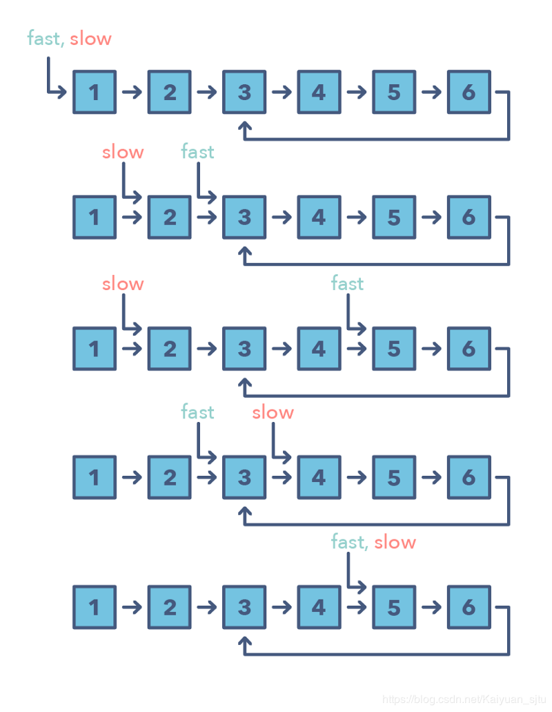
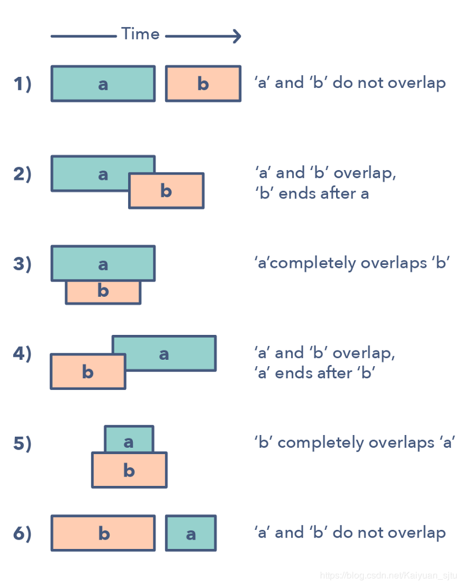
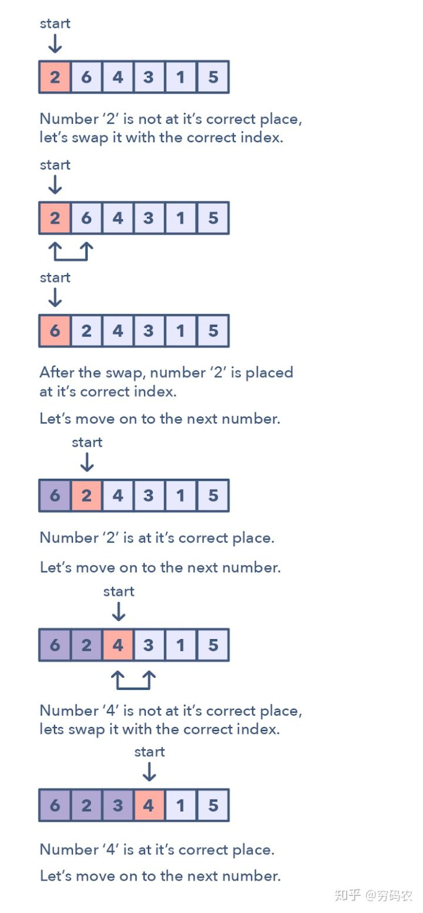
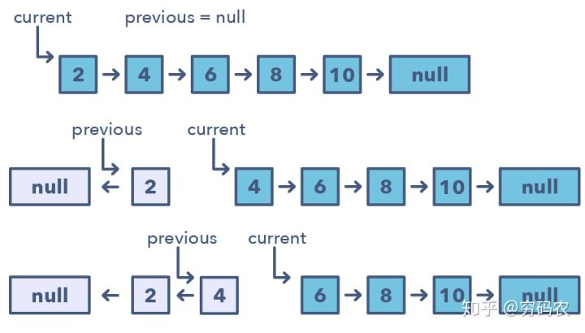
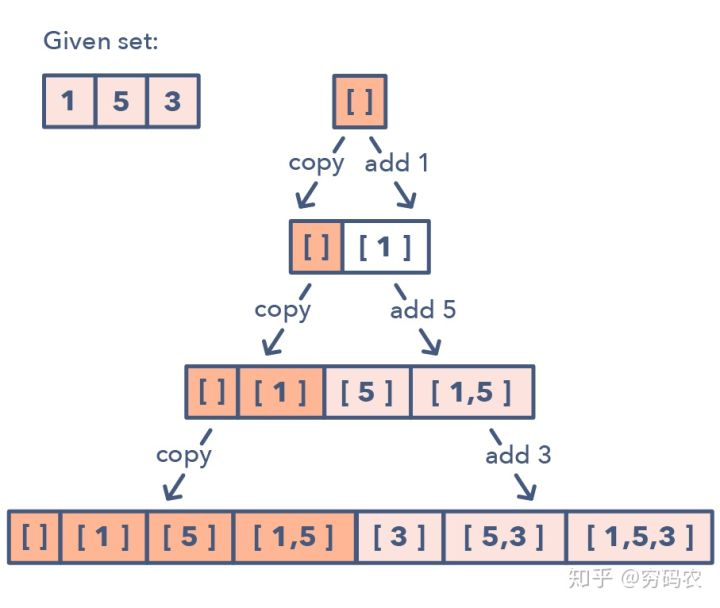
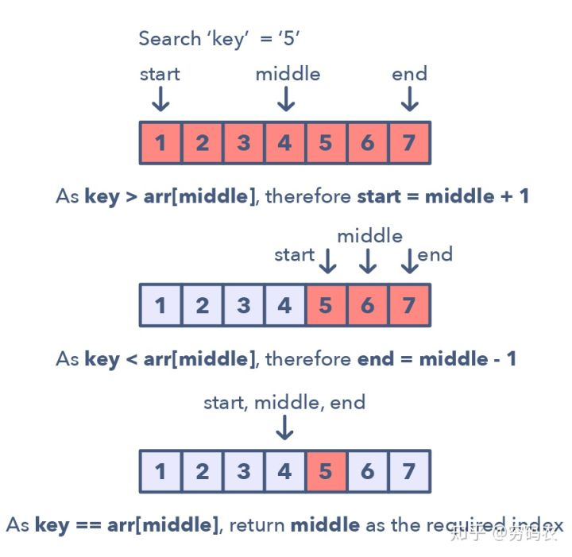

# 算法题目求解方法的 14 种模式

[TOC]

---

## 1. Pattern: Sliding window，滑动窗口类型

滑动窗口类型的题目经常是用来执行数组或是链表上某个区间（窗口）上的操作。比如找最长的全为 1 的子数组长度。滑动窗口一般从第一个元素开始，一直往右边一个一个元素挪动。当然了，根据题目要求，我们可能有固定窗口大小的情况，也有窗口的大小变化的情况。

### 应用场景

- 这个问题的输入是一些线性结构：比如链表呀，数组啊，字符串啊之类的
- 让你去求最长/最短子字符串或是某些特定的长度要求

### 经典题目

#### 3. 无重复字符的最长子串

这道题目可以使用 128 位的数组来表示所有字符。开始每个字符都初始化为-1

然后这道题目其实是维护一个滑动窗口。滑动窗口左边界是 left，右边界是当前访问的数组下标。

left 的更新策略是：

left = max(left, dp[s[i]]);

也就是如果一直没有被访问过重复字符，那么 left 一直维持在-1;窗口的长度就是当前下标减去 left.

然后如果出现了重复字符，那么 left 就立刻更新到之前出现的位置。

注意 dp[]数组也在不断更新，保存的是上一次出现的位置，用于如果出现了重复，可以把滑动窗口左边界拉过来。

#### 面试题 59 - I. 滑动窗口的最大值

使用一个大顶堆来表示当前的滑动窗口，大顶堆里面存储的是数字数值以及下标。

#### 76. 最小覆盖子串

这道题给了我们一个原字符串 S，还有一个目标字符串 T，让在 S 中找到一个最短的子串，使得其包含了 T 中的所有的字母，并且限制了时间复杂度为 O(n)。这道题的要求是要在 O(n) 的时间度里实现找到这个最小窗口字串，暴力搜索 Brute Force 肯定是不能用的，因为遍历所有的子串的时间复杂度是平方级的。那么来想一下，时间复杂度卡的这么严，说明必须在一次遍历中完成任务，当然遍历若干次也是 O(n)，但不一定有这个必要，尝试就一次遍历拿下！那么再来想，既然要包含 T 中所有的字母，那么对于 T 中的每个字母，肯定要快速查找是否在子串中，既然总时间都卡在了 O(n)，肯定不想在这里还浪费时间，就用空间换时间（也就算法题中可以这么干了，七老八十的富翁就算用大别野也换不来时间啊。依依东望，望的就是时间呐 T.T），使用 HashMap，建立 T 中每个字母与其出现次数之间的映射，那么你可能会有疑问，为啥不用 HashSet 呢，别急，讲到后面你就知道用 HashMap 有多妙，简直妙不可言～

目前在脑子一片浆糊的情况下，我们还是从简单的例子来分析吧，题目例子中的 S 有点长，换个短的 S = "ADBANC"，T = "ABC"，那么肉眼遍历一遍 S 呗，首先第一个是 A，嗯很好，T 中有，第二个是 D，T 中没有，不理它，第三个是 B，嗯很好，T 中有，第四个又是 A，多了一个，礼多人不怪嘛，收下啦，第五个是 N，一边凉快去，第六个终于是 C 了，那么貌似好像需要整个 S 串，其实不然，注意之前有多一个 A，就算去掉第一个 A，也没事，因为第四个 A 可以代替之，第二个 D 也可以去掉，因为不在 T 串中，第三个 B 就不能再去掉了，不然就没有 B 了。所以最终的答案就"BANC"了。通过上面的描述，你有没有发现一个有趣的现象，先扩展，再收缩，就好像一个窗口一样，先扩大右边界，然后再收缩左边界，上面的例子中右边界无法扩大了后才开始收缩左边界，实际上对于复杂的例子，有可能是扩大右边界，然后缩小一下左边界，然后再扩大右边界等等。这就很像一个不停滑动的窗口了，这就是大名鼎鼎的滑动窗口 Sliding Window 了，简直是神器啊，能解很多子串，子数组，子序列等等的问题，是必须要熟练掌握的啊！

下面来考虑用代码来实现，先来回答一下前面埋下的伏笔，为啥要用 HashMap，而不是 HashSet，现在应该很显而易见了吧，因为要统计 T 串中字母的个数，而不是仅仅看某个字母是否在 T 串中出现。统计好 T 串中字母的个数了之后，开始遍历 S 串，对于 S 中的每个遍历到的字母，都在 HashMap 中的映射值减 1，如果减 1 后的映射值仍大于等于 0，说明当前遍历到的字母是 T 串中的字母，使用一个计数器 cnt，使其自增 1。当 cnt 和 T 串字母个数相等时，说明此时的窗口已经包含了 T 串中的所有字母，此时更新一个 minLen 和结果 res，这里的 minLen 是一个全局变量，用来记录出现过的包含 T 串所有字母的最短的子串的长度，结果 res 就是这个最短的子串。然后开始收缩左边界，由于遍历的时候，对映射值减了 1，所以此时去除字母的时候，就要把减去的 1 加回来，此时如果加 1 后的值大于 0 了，说明此时少了一个 T 中的字母，那么 cnt 值就要减 1 了，然后移动左边界 left。你可能会疑问，对于不在 T 串中的字母的映射值也这么加呀减呀的，真的大丈夫（带胶布）吗？其实没啥事，因为对于不在 T 串中的字母，减 1 后，变-1，cnt 不会增加，之后收缩左边界的时候，映射值加 1 后为 0，cnt 也不会减少，所以并没有什么影响啦，下面是具体的步骤啦：

- 先扫描一遍 T，把对应的字符及其出现的次数存到 HashMap 中。

- 然后开始遍历 S，就把遍历到的字母对应的 HashMap 中的 value 减一，如果减 1 后仍大于等于 0，cnt 自增 1。

- 如果 cnt 等于 T 串长度时，开始循环，纪录一个字串并更新最小字串值。然后将子窗口的左边界向右移，如果某个移除掉的字母是 T 串中不可缺少的字母，那么 cnt 自减 1，表示此时 T 串并没有完全匹配。

更优化的方法：

这道题也可以不用 HashMap，直接用个 int 的数组来代替，因为 ASCII 只有 256 个字符，所以用个大小为 256 的 int 数组即可代替 HashMap，但由于一般输入字母串的字符只有 128 个，所以也可以只用 128，其余部分的思路完全相同，虽然只改了一个数据结构，但是运行速度提高了一倍，说明数组还是比 HashMap 快啊。在热心网友 chAngelts 的提醒下，还可以进一步的优化，没有必要每次都计算子串，只要有了起始位置和长度，就能唯一的确定一个子串。这里使用一个全局变量 minLeft 来记录最终结果子串的起始位置，初始化为 -1，最终配合上 minLen，就可以得到最终结果了。注意在返回的时候要检测一下若 minLeft 仍为初始值 -1，需返回空串

#### 992. K 个不同整数的子数组

滑动窗口。

这道题目也是使用滑动窗口可以进行解决。

核心思想就是窗口右边界开拓，遇到限制条件了之后，那么开始收缩左边界。

使用两个关键变量：ans 最后的计数个数，cnt 滑动窗口里面不同数字的个数。

而且使用一个 hashmap 或者固定数组来计数，确定好计数条件来表示什么时候是新数字，什么时候不是新数字，以此区分来影响对 cnt 的效果。

这道题目和题目 76 很像。

#### 480. 滑动窗口中位数

使用滑动窗口和大小堆实现。

大小堆使用 multiset 实现起来比较方便，因为相比于 priority_queue, multiset 实现的大小堆可以访问中间的数字，而且可以查找中间的数字，而且可以遍历数字，因为其中的数字顺序都是有序的，所以大堆和小堆都是一样的数据结构就可以，只需要看你取最前面的还是最後面的，还可以使用 next(),以及 prev()函数移动指针。

求中位值，可以直接考虑使用大小堆。

这道题目关键是处理好删除数据，更关键是添加新数据的时候，如果维护好两个堆的大小关键，调整数字，使得小堆的 size 总是等于或仅大 1 大堆的数字。

#### 209. 长度最小的子数组

可以使用滑动窗口实现，先拓展右边界，然后回来缩短左边界。

下面再来看看 O(nlgn) 的解法，这个解法要用到二分查找法，思路是，建立一个比原数组长一位的 sums 数组，其中 sums[i] 表示 nums 数组中 [0, i - 1] 的和，然后对于 sums 中每一个值 sums[i]，用二分查找法找到子数组的右边界位置，使该子数组之和大于 sums[i] + s，然后更新最短长度的距离即可。

## 2. 双指针

双指针的基本思想是使用两个指针串联迭代数据结构，知道一个或两个指针达到某个条件停止。 在排序数组或链表中搜索元素对时，两个指针通常很有用， 例如将数组的每个元素与其他元素进行比较时。

通常我们需要两个指针是因为如果只采用单个指针，必须不断循环数组才能找到答案。这种解决方案虽然确实可行，但是对时间和空间复杂度来说明显是低效的 O(n2) O(n^{2})O(n
2
)。在许多情况下，使用双指针可以帮助你找到具有更好空间或时间复杂度的解决方案。

### 应用场景

- 问题为**排序数组**或**链表**，并且需要满足某些约束的一组元素问题
- 数组中的元素集是一对，三元组，甚至是子数组

### 经典题目

#### N-sum 问题

##### 1. 两数之和

无序数组，不能使用双指针，使用 hashmap 解决。

##### 167. 两数之和 II - 输入有序数组

有序数组，使用双指针解决。

##### 653. 两数之和 IV - 输入 BST

这道题目将原来的数组换成了搜索二叉树, 搜索二叉树可以看作是一个有序的数组，就是中序遍历的结果。我们一种方法是可以中序遍历得到一个有序数组，然后使用双指针解决。另一种方法就是直接中序遍历，加上 hashset 或者 hashmap 进行记录历史数值，也可以。这两种方法分别对应了两数之和 I 和两数之和 II 的对应的方法。

##### 15. 三数之和

类似于 two num 题目的解法，但是不同的是要固定一个数字，然后找到另外两个数字，同时需要注意不要有重复的组合出现，解决方法是对于相同的数字，我们就将 index 跳过。

关键是如何排除相同的对象，尽量不要使用当前元素与 ans 里面的元素进行比较。

关键是要找到规律，如果发现元素相同（本质上就是相同等级的元素起得作用相同）的话，那么就跳过。

##### 18. 四数之和

这道题目是三数之和的拓展，本质上原理和三数之和是一样的，只不过是再多循环一层，然后就是按照同样的规律排除相同的元素，防止结果里面出现同样的元素。

#### 42. 接雨水

只需要遍历一次即可的解法，这个算法需要 left 和 right 两个指针分别指向数组的首尾位置，从两边向中间扫描，在当前两指针确定的范围内，先比较两头找出较小值，如果较小值是 left 指向的值，则从左向右扫描，如果较小值是 right 指向的值，则从右向左扫描，若遇到的值比当较小值小，则将差值存入结果，如遇到的值大，则重新确定新的窗口范围，以此类推直至 left 和 right 指针重合，

另外一个比较简单的解法。思路就是 1. 扫描一遍，找到最高的柱子，这个柱子将数组分为两半; 2. 处理左边一半; 3. 处理右边一半。

## 3、快慢指针

也被称为“龟兔算法”，基本思想是使用两个指针以不同的速度在数组或链表中移动。在处理循环链表或数组时，此方法非常有用。通过以不同的速度移动（例如，在循环链表中），算法证明两个指针必然会相遇。 一旦两个指针都处于循环中，快速指针就应该捕获慢速指针。

### 应用场景

- 链表或数组循环
- 用于找中间元素
- 需要知道某个元素的位置或链表的总长度

### 经典题目

#### 141. 环形链表

使用双指针，一个指针每次移动一个节点，一个指针每次移动两个节点，如果存在环，那么这两个指针一定会相遇。如果快指针到达末尾，则说明没有环。

#### 142. 环形链表 II

这个求单链表中的环的起始点是之前那个判断单链表中是否有环的延伸，可参之前那道 Linked List Cycle。这里还是要设快慢指针，不过这次要记录两个指针相遇的位置，当两个指针相遇了后，让其中一个指针从链表头开始，一步两步，一步一步似爪牙，似魔鬼的步伐。。。哈哈，打住打住。。。此时再相遇的位置就是链表中环的起始位置，为啥是这样呢，这里直接贴上热心网友「飞鸟想飞」的解释哈，因为快指针每次走 2，慢指针每次走 1，快指针走的距离是慢指针的两倍。而快指针又比慢指针多走了一圈。所以 head 到环的起点+环的起点到他们相遇的点的距离 与 环一圈的距离相等。现在重新开始，head 运行到环起点 和 相遇点到环起点 的距离也是相等的，相当于他们同时减掉了 环的起点到他们相遇的点的距离

#### 160. 相交链表

这道题目是确定两个链表的相交焦点。

可以使用循环两次的方法，当其中一个链表到达结尾之后，跳转到另一个链表。

如果有焦点，那么循环两次之后一定在焦点相遇，如果没有焦点，那么一定在链表的末尾相遇，而且都是 NULL;

## 4、合并区间

合并间隔模式是处理重叠间隔的有效技术。 在涉及间隔的许多问题中，你可以需要找到重叠间隔或合并间隔（如果它们重叠）。给定两个间隔 a aa 和 b bb，可能存在 6 中不同的间隔交互情况：

### 应用场景

- 要求生成仅具有互斥间隔的列表
- 出现“overlapping intervals”一词

### 经典题目

#### 56. 合并区间

判断前一个区间的尾巴和下一区间的脑袋是不是重叠，如果重叠就把下一个区间融合进去。

设置一个变量 left 表示接受改变的区间，right 变量表示不断候选准备融合进去的区间。

如果不重合，那么 left = right, right = left + 1

#### 57. 插入区间

本质上和合并区间一样，先插入进去一段区间，然后排序，再然后合并区间。

#### 986. 区间列表的交集

寻找区间的交集，可以设置两个指针，分别遍历两个数组，然后设定判断条件来是指针递增。

## 5. 循环排序

这种模式讲述的是一直很好玩的方法：可以用来处理数组中的数值限定在一定的区间的问题。这种模式一个个遍历数组中的元素，如果当前这个数它不在其应该在的位置的话，咱们就把它和它应该在的那个位置上的数交换一下。你可以尝试将该数放到其正确的位置上，但这复杂度就会是 O(n^2)。这样的话，可能就不是最优解了。因此循环排序的优势就体现出来了。

### 应用场景

- 这些问题一般涉及到排序好的数组，而且数值一般满足于一定的区间
- 如果问题让你需要在排好序/翻转过的数组中，寻找丢失的/重复的/最小的元素

### 经典题目

#### 268. Missing Number

使用循环排序也是可以的，先进行循环排序，那么每个数字就会都在其最合适的位置，然后再遍历一次，找到不合适位置的那个数字，那么他的坐标就是我们想要寻找的丢失数字。

这道题给我们 n 个数字，是 0 到 n 之间的数但是有一个数字去掉了，让我们寻找这个数字，要求线性的时间复杂度和常数级的空间复杂度。那么最直观的一个方法是用等差数列的求和公式求出 0 到 n 之间所有的数字之和，然后再遍历数组算出给定数字的累积和，然后做减法，差值就是丢失的那个数字

这题还有一种解法，使用位操作 Bit Manipulation 来解的，用到了异或操作的特性，相似的题目有 Single Number 单独的数字, Single Number II 单独的数字之二和 Single Number III 单独的数字之三。那么思路是既然 0 到 n 之间少了一个数，我们将这个少了一个数的数组合 0 到 n 之间完整的数组异或一下，那么相同的数字都变为 0 了，剩下的就是少了的那个数字了

这道题还可以用二分查找法来做，我们首先要对数组排序，然后我们用二分查找法算出中间元素的下标，然后用元素值和下标值之间做对比，如果元素值大于下标值，则说明缺失的数字在左边，此时将 right 赋为 mid，反之则将 left 赋为 mid+1。那么看到这里，作为读者的你可能会提出，排序的时间复杂度都不止 O(n)，何必要多此一举用二分查找，还不如用上面两种方法呢。对，你说的没错，但是在面试的时候，有可能人家给你的数组就是排好序的，那么此时用二分查找法肯定要优于上面两种方法，所以这种方法最好也要掌握以下~

#### 41. 缺失的第一个正数

将数组视为哈希表
由于题目要求我们“只能使用常数级别的空间”，而要找的数一定在 [1, N + 1] 左闭右闭（这里 N 是数组的长度）这个区间里。因此，我们可以就把原始的数组当做哈希表来使用。事实上，哈希表其实本身也是一个数组；
我们要找的数就在 [1, N + 1] 里，最后 N + 1 这个元素我们不用找。因为在前面的 N 个元素都找不到的情况下，我们才返回 N + 1；
那么，我们可以采取这样的思路：就把 11 这个数放到下标为 00 的位置， 22 这个数放到下标为 11 的位置，按照这种思路整理一遍数组。然后我们再遍历一次数组，第 11 个遇到的它的值不等于下标的那个数，就是我们要找的缺失的第一个正数。
这个思想就相当于我们自己编写哈希函数，这个哈希函数的规则特别简单，那就是数值为 i 的数映射到下标为 i - 1 的位置。

## 6. 原地链表翻转

在众多问题中，题目可能需要你去翻转链表中某一段的节点。通常，要求都是你得原地翻转，就是重复使用这些已经建好的节点，而不使用额外的空间。这个时候，原地翻转模式就要发挥威力了。

这种模式每次就翻转一个节点。一般需要用到多个变量，一个变量指向头结点（下图中的 current），另外一个（previous）则指向咱们刚刚处理完的那个节点。在这种固定步长的方式下，你需要先将当前节点（current）指向前一个节点（previous），再移动到下一个。同时，你需要将 previous 总是更新到你刚刚新鲜处理完的节点，以保证正确性。

### 应用场景

- 如果你被问到需要去翻转链表，要求不能使用额外空间的时候

### 经典题目

#### 206. Reverse Linked List

链表反转。

包括迭代方法和递归方法。迭代方法就是设置一个 pre 指针，然后不断插入到 pre->next。递归方法就是不断进行递归，每次递归返回一个头指针，注意保存临时变量。

重要注意的点就是算清楚 next 的链接关系。

还要学会递归实现

#### 92. 反转链表 II

和反转链表 1 的迭代解法很像，还是设置一个头节点。

但是，要注意的是计数变量的不同情况下的处理方式。

## 7. 双堆模式

很多问题中，我们被告知，我们拿到一大把可以分成两队的数字。为了解决这个问题，我们感兴趣的是，怎么把数字分成两半？使得：小的数字都放在一起，大的放在另外一半。双堆模式就能高效解决此类问题。

正如名字所示，该模式用到了两个堆，是不是很难猜？一个最小堆用来找最小元素；一个最大堆，拿到最大元素。这种模式将一半的元素放在最大堆中，这样你可以从这一堆中秒找到最大元素。同理，把剩下一半丢到最小堆中，O(1)时间找到他们中的最小元素。通过这样的方式，这一大堆元素的中位数就可以从两个堆的堆顶拿到数字，从而计算出来。

### 应用场景

- 这种模式在优先队列，计划安排问题（Scheduling）中有奇效
- 如果问题让你找一组数中的最大/最小/中位数
- 有时候，这种模式在涉及到二叉树数据结构时也特别有用

### 经典题目

#### 295. 找出数据流的中位数

这道题给我们一个数据流，让我们找出中位数，由于数据流中的数据并不是有序的，所以我们首先应该想个方法让其有序。如果我们用 vector 来保存数据流的话，每进来一个新数据都要给数组排序，很不高效。所以之后想到用 multiset 这个数据结构，是有序保存数据的，但是它不能用下标直接访问元素，找中位数也不高效。这里用到的解法十分巧妙，我们使用大小堆来解决问题，其中大堆保存右半段较大的数字，小堆保存左半段较小的数组。这样整个数组就被中间分为两段了，由于堆的保存方式是由大到小，我们希望大堆里面的数据是从小到大，这样取第一个来计算中位数方便。我们用到一个小技巧，就是存到大堆里的数先取反再存，这样由大到小存下来的顺序就是实际上我们想要的从小到大的顺序。当大堆和小堆中的数字一样多时，我们取出大堆小堆的首元素求平均值，当小堆元素多时，取小堆首元素为中位数

#### 面试题 59 - I. 滑动窗口的最大值

这道题给定了一个数组，还给了一个窗口大小 k，让我们每次向右滑动一个数字，每次返回窗口内的数字的最大值。难点就在于如何找出滑动窗口内的最大值（这不废话么，求得不就是这个），那么最狂野粗暴的方法就是每次遍历窗口，找最大值呗，OJ 说呵呵哒，no way！我们希望窗口内的数字是有序的，但是每次给新窗口排序又太费时了，所以最好能有一种类似二叉搜索树的结构，可以在 lgn 的时间复杂度内完成插入和删除操作，那么使用 STL 自带的 multiset 就能满足我们的需求，这是一种基于红黑树的数据结构，可以自动对元素进行排序，又允许有重复值，完美契合。所以我们的思路就是，遍历每个数字，即窗口右移，若超过了 k，则需要把左边界值删除，这里不能直接删除 nums[i-k]，因为集合中可能有重复数字，我们只想删除一个，而 erase 默认是将所有和目标值相同的元素都删掉，所以我们只能提供一个 iterator，代表一个确定的删除位置，先通过 find() 函数找到左边界 nums[i-k] 在集合中的位置，再删除即可。然后将当前数字插入到集合中，此时看若 i >= k-1，说明窗口大小正好是 k，就需要将最大值加入结果 res 中，而由于 multiset 是按升序排列的，最大值在最后一个元素，我们可以通过 rbegin() 来取出。

我们也可以使用优先队列来做，即最大堆，不过此时我们里面放一个 pair 对儿，由数字和其所在位置组成的，这样我们就可以知道每个数字的位置了，而不用再进行搜索了。在遍历每个数字时，进行 while 循环，假如优先队列中最大的数字此时不在窗口中了，就要移除，判断方法就是将队首元素的 pair 对儿中的 second（位置坐标）跟 i-k 对比，小于等于就移除。然后将当前数字和其位置组成 pair 对儿加入优先队列中。此时看若 i >= k-1，说明窗口大小正好是 k，就将最大值加入结果 res 中即可

#### 480. 滑动窗口中位数

使用滑动窗口和大小堆实现。

大小堆使用 multiset 实现起来比较方便，因为相比于 priority_queue, multiset 实现的大小堆可以访问中间的数字，而且可以查找中间的数字，而且可以遍历数字，因为其中的数字顺序都是有序的，所以大堆和小堆都是一样的数据结构就可以，只需要看你取最前面的还是最後面的，还可以使用 next(),以及 prev()函数移动指针。

求中位值，可以直接考虑使用大小堆。

这道题目关键是处理好删除数据，更关键是添加新数据的时候，如果维护好两个堆的大小关键，调整数字，使得小堆的 size 总是等于或仅大 1 大堆的数字。

## 8. 树上的 DFS

树形 DFS 基于深搜（Depth First Search (DFS)）技术来实现树的遍历。

咱们可以用递归（或是显示栈，如果你想用迭代方式的话）来记录遍历过程中访问过的父节点。

该模式的运行方式是从根节点开始，如果该节点不是叶子节点，我们需要干两件事：

- 需要区别我们是先处理根节点（pre-order，前序），处理孩子节点之间处理根节点（in-order，中序），还是处理完所有孩子再处理根节点（post-order，后序）。
- 递归处理当前节点的左右孩子。

### 应用场景

你需要按前中后序的 DFS 方式遍历树
如果该问题的解一般离叶子节点比较近。

### 经典题目

#### 129. 求根到叶子节点数字之和

回溯法即可。

#### 104. 二叉树的最大深度

计算树的高度，使用递归的思想可以完成。

#### 106. 从中序与后序遍历序列构造二叉树

递归实现，主要使用多个变量分割字符串的区间。

#### 112. path sum

使用回溯进行解决，然后注意边界条件就可以。

## 9. 树上的 BFS

这种模式基于宽搜（Breadth First Search (BFS)），适用于需要遍历一颗树。借助于队列数据结构，从而能保证树的节点按照他们的层数打印出来。打印完当前层所有元素，才能执行到下一层。所有这种需要遍历树且需要一层一层遍历的问题，都能用这种模式高效解决。

这种树上的 BFS 模式是通过把根节点加到队列中，然后不断遍历直到队列为空。每一次循环中，我们都会把队头结点拿出来（remove），然后对其进行必要的操作。在删除每个节点的同时，其孩子节点，都会被加到队列中。

### 应用场景

如果你被问到去遍历树，需要按层操作的方式（也称作层序遍历）

### 经典题目

#### 429. N 叉树的层序遍历

典型的数的层次遍历。

#### 102. 二叉树的层次遍历

数的层次遍历

#### 103. 二叉树的锯齿形层次遍历

二叉树层次遍历 + 反转数组

## 10. 子集问题模式

超级多的编程面试问题都会涉及到排列和组合问题。子集问题模式讲的是用 BFS 来处理这些问题。

这个模式是这样的：

给一组数字 [1, 5, 3]

我们从空集开始：`[[]]`
把第一个数（1），加到之前已经存在的集合中：`[[], [1]]`;
把第二个数（5），加到之前的集合中得到：`[[], [1], [5], [1,5]]`;
再加第三个数（3），则有：`[[], [1], [5], [1,5], [3], [1,3], [5,3], [1,5,3]]`.

该模式的详细步骤如下：

### 应用场景

- 问题需要咱们去找数字的组合或是排列

### 经典题目

#### 78. subsets

递归，回溯法。要设置的变量 paths , path， index, nums(输入变量)

处理一组给定元素的排列和组合。 Subsets 模式描述了一种有效的广度优先搜索（BFS）方法来处理所有这些问题。
例如给定一个数组 `[1, 5, 3]`

另外一种方法:
首先初始化一个空数组： [[ ]]
将第一个数字(1)添加到所有现有子集，以创建新的子集: `[[], [1]]`
继续添加`[[], [1], [5], [1, 5]] [[], [1], [5], [1, 5], [3], [1, 3], [5, 3], [1, 5, 3]]`

#### 784. 字母大小写全排列

使用类似于题目 78 里面 subset 的方法，可以很方便的实现。

处理一组给定元素的排列和组合。 Subsets 模式描述了一种有效的广度优先搜索（BFS）方法来处理所有这些问题。

例如给定一个数组 `[1, 5, 3]`

另外一种方法:
首先初始化一个空数组： [[ ]]
将第一个数字(1)添加到所有现有子集，以创建新的子集: `[[], [1]]`
继续添加`[[], [1], [5], [1, 5]] [[], [1], [5], [1, 5], [3], [1, 3], [5, 3], [1, 5, 3]]`

## 11. 二分变种

当你需要解决的问题的输入是排好序的数组，链表，或是排好序的矩阵，要求咱们寻找某些特定元素。这个时候的不二选择就是二分搜索。这种模式是一种超级牛的用二分来解决问题的方式。

对于一组满足上升排列的数集来说，这种模式的步骤是这样的：

首先，算出左右端点的中点。最简单的方式是这样的：middle = (start + end) / 2。但这种计算方式有不小的概率会出现整数越界。因此一般都推荐另外这种写法：middle = start + (end — start) / 2

如果要找的目标改好和中点所在的数值相等，我们返回中点的下标就行
如果目标不等的话：我们就有两种移动方式了
如果目标比中点在的值小（key < arr[middle]）：将下一步搜索空间放到左边（end = middle）
如果比中点的值大，则继续在右边搜索，丢弃左边：left = middle + 1

图示该过程的话，如下图所示：

### 应用场景

查找一个数字，且查找区间是有一定规律的

### 经典题目

#### 153. 寻找旋转排序数组中的最小值

非经典的二分查找，关键是找到数据的规律以及分割条件。

#### 4. 寻找两个有序数组的中位数

这道题让我们求两个有序数组的中位数，而且限制了时间复杂度为 O(log (m+n))，看到这个时间复杂度，自然而然的想到了应该使用二分查找法来求解。但是这道题被定义为 Hard 也是有其原因的，难就难在要在两个未合并的有序数组之间使用二分法，如果这道题只有一个有序数组，让求中位数的话，估计就是个 Easy 题。对于这道题来说，可以将两个有序数组混合起来成为一个有序数组再做吗，图样图森破，这个时间复杂度限制的就是告诉你金坷垃别想啦。还是要用二分法，而且是在两个数组之间使用，感觉很高端啊。回顾一下中位数的定义，如果某个有序数组长度是奇数，那么其中位数就是最中间那个，如果是偶数，那么就是最中间两个数字的平均值。这里对于两个有序数组也是一样的，假设两个有序数组的长度分别为 m 和 n，由于两个数组长度之和 m+n 的奇偶不确定，因此需要分情况来讨论，对于奇数的情况，直接找到最中间的数即可，偶数的话需要求最中间两个数的平均值。为了简化代码，不分情况讨论，使用一个小 trick，分别找第 (m+n+1) / 2 个，和 (m+n+2) / 2 个，然后求其平均值即可，这对奇偶数均适用。若 m+n 为奇数的话，那么其实 (m+n+1) / 2 和 (m+n+2) / 2 的值相等，相当于两个相同的数字相加再除以 2，还是其本身。

好，这里需要定义一个函数来在两个有序数组中找到第 K 个元素，下面重点来看如何实现找到第 K 个元素。首先，为了避免拷贝产生新的数组从而增加时间复杂度，使用两个变量 i 和 j 分别来标记数组 nums1 和 nums2 的起始位置。然后来处理一些 corner cases，比如当某一个数组的起始位置大于等于其数组长度时，说明其所有数字均已经被淘汰了，相当于一个空数组了，那么实际上就变成了在另一个数组中找数字，直接就可以找出来了。还有就是如果 K=1 的话，只要比较 nums1 和 nums2 的起始位置 i 和 j 上的数字就可以了。难点就在于一般的情况怎么处理？因为需要在两个有序数组中找到第 K 个元素，为了加快搜索的速度，可以使用二分法，那么对谁二分呢，数组么？其实要对 K 二分，意思是需要分别在 nums1 和 nums2 中查找第 K/2 个元素，注意这里由于两个数组的长度不定，所以有可能某个数组没有第 K/2 个数字，所以需要先 check 一下，数组中到底存不存在第 K/2 个数字，如果存在就取出来，否则就赋值上一个整型最大值（目的是要在 nums1 或者 nums2 中先淘汰 K/2 个较小的数字，判断的依据就是看 midVal1 和 midVal2 谁更小，但如果某个数组的个数都不到 K/2 个，自然无法淘汰，所以将其对应的 midVal 值设为整型最大值，以保证其不会被淘汰），若某个数组没有第 K/2 个数字，则淘汰另一个数组的前 K/2 个数字即可。举个例子来说吧，比如 nums1 = {3}，nums2 = {2, 4, 5, 6, 7}，K=4，要找两个数组混合中第 4 个数字，则分别在 nums1 和 nums2 中找第 2 个数字，而 nums1 中只有一个数字，不存在第二个数字，则 nums2 中的前 2 个数字可以直接跳过，为啥呢，因为要求的是整个混合数组的第 4 个数字，不管 nums1 中的那个数字是大是小，第 4 个数字绝不会出现在 nums2 的前两个数字中，所以可以直接跳过。

有没有可能两个数组都不存在第 K/2 个数字呢，这道题里是不可能的，因为 K 不是任意给的，而是给的 m+n 的中间值，所以必定至少会有一个数组是存在第 K/2 个数字的。最后就是二分法的核心啦，比较这两个数组的第 K/2 小的数字 midVal1 和 midVal2 的大小，如果第一个数组的第 K/2 个数字小的话，那么说明要找的数字肯定不在 nums1 中的前 K/2 个数字，可以将其淘汰，将 nums1 的起始位置向后移动 K/2 个，并且此时的 K 也自减去 K/2，调用递归，举个例子来说吧，比如 nums1 = {1, 3}，nums2 = {2, 4, 5}，K=4，要找两个数组混合中第 4 个数字，那么分别在 nums1 和 nums2 中找第 2 个数字，nums1 中的第 2 个数字是 3，nums2 中的第 2 个数字是 4，由于 3 小于 4，所以混合数组中第 4 个数字肯定在 nums2 中，可以将 nums1 的起始位置向后移动 K/2 个。反之，淘汰 nums2 中的前 K/2 个数字，并将 nums2 的起始位置向后移动 K/2 个，并且此时的 K 也自减去 K/2，调用递归即可，参见代码

---

另一种解释：

上边的两种思路，时间复杂度都达不到题目的要求 O(log(m+n)O(log(m+n)。看到 log，很明显，我们只有用到二分的方法才能达到。我们不妨用另一种思路，题目是求中位数，其实就是求第 k 小数的一种特殊情况，而求第 k 小数有一种算法。

解法二中，我们一次遍历就相当于去掉不可能是中位数的一个值，也就是一个一个排除。由于数列是有序的，其实我们完全可以一半儿一半儿的排除。假设我们要找第 k 小数，我们可以每次循环排除掉 k/2 个数。看下边一个例子。

假设我们要找第 7 小的数字。

我们比较两个数组的第 k/2 个数字，如果 k 是奇数，向下取整。也就是比较第 33 个数字，上边数组中的 44 和下边数组中的 33，如果哪个小，就表明该数组的前 k/2 个数字都不是第 k 小数字，所以可以排除。也就是 11，22，33 这三个数字不可能是第 77 小的数字，我们可以把它排除掉。将 13491349 和 4567891045678910 两个数组作为新的数组进行比较。

更一般的情况 `A[1] ，A[2] ，A[3]，A[k/2] ... ，B[1]，B[2]，B[3]，B[k/2]` ... ，如果 `A[k/2]<B[k/2]` ，那么 `A[1]，A[2]，A[3]，A[k/2]`都不可能是第 k 小的数字。

A 数组中比 A[k/2] 小的数有 k/2-1 个，B 数组中，B[k/2] 比 A[k/2] 小，假设 B[k/2] 前边的数字都比 A[k/2] 小，也只有 k/2-1 个，所以比 A[k/2] 小的数字最多有 k/1-1+k/2-1=k-2 个，所以 A[k/2] 最多是第 k-1 小的数。而比 A[k/2] 小的数更不可能是第 k 小的数了，所以可以把它们排除。

橙色的部分表示已经去掉的数字。

由于我们已经排除掉了 3 个数字，就是这 3 个数字一定在最前边，所以在两个新数组中，我们只需要找第 7 - 3 = 4 小的数字就可以了，也就是 k = 4。此时两个数组，比较第 2 个数字，3 < 5，所以我们可以把小的那个数组中的 1 ，3 排除掉了。

我们又排除掉 2 个数字，所以现在找第 4 - 2 = 2 小的数字就可以了。此时比较两个数组中的第 k / 2 = 1 个数，4 == 4，怎么办呢？由于两个数相等，所以我们无论去掉哪个数组中的都行，因为去掉 1 个总会保留 1 个的，所以没有影响。为了统一，我们就假设 4 > 4 吧，所以此时将下边的 4 去掉。

由于又去掉 1 个数字，此时我们要找第 1 小的数字，所以只需判断两个数组中第一个数字哪个小就可以了，也就是 4。

所以第 7 小的数字是 4。

我们每次都是取 k/2 的数进行比较，有时候可能会遇到数组长度小于 k/2 的时候。

此时 k / 2 等于 3，而上边的数组长度是 2，我们此时将箭头指向它的末尾就可以了。这样的话，由于 2 < 3，所以就会导致上边的数组 1，2 都被排除。造成下边的情况。

由于 2 个元素被排除，所以此时 k = 5，又由于上边的数组已经空了，我们只需要返回下边的数组的第 5 个数字就可以了。

从上边可以看到，无论是找第奇数个还是第偶数个数字，对我们的算法并没有影响，而且在算法进行中，k 的值都有可能从奇数变为偶数，最终都会变为 1 或者由于一个数组空了，直接返回结果。

所以我们采用递归的思路，为了防止数组长度小于 k/2，所以每次比较 min(k/2，len(数组) 对应的数字，把小的那个对应的数组的数字排除，将两个新数组进入递归，并且 k 要减去排除的数字的个数。递归出口就是当 k=1 或者其中一个数字长度是 0 了

参考链接：

https://leetcode-cn.com/problems/median-of-two-sorted-arrays/solution/xiang-xi-tong-su-de-si-lu-fen-xi-duo-jie-fa-by-w-2/
