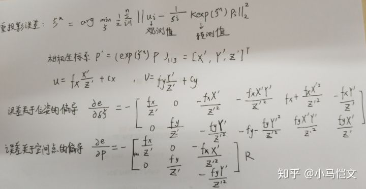
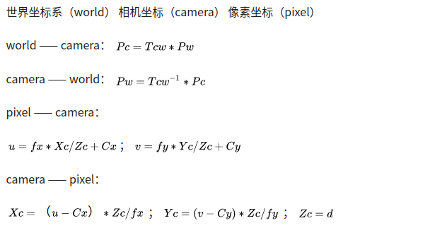
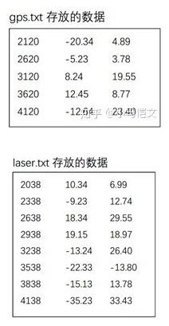
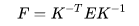

- 牛客看招聘信息，并进行汇总
- 看面经并进行知识点总结

自我介绍

## 项目点

实验室的研究方向

自己的研究方向

讲一下自己的项目，自己的贡献，当前怎么改进项目，还有哪些可以改进的地方

github 上面的贡献

项目的难点，自己怎么改进的

你在项目中遇到的最大困难吗？(注意这里 HR 只问了困难，但他根本不关心困难，而关心你如何解决的，如果你只说了困难，他还会追问如何解决，最好能说说解决的流程和方法，是面试加分项

你在项目中承担的角色以及做的贡献？

## 基础知识知识点

设计模式
https://note.youdao.com/ynoteshare1/index.html?id=21b940eac79a3b8042997a7373aad144&type=note
操作系统 计算机网络
https://note.youdao.com/ynoteshare1/index.html?id=1665ad9154f4ed041910364a9aa1e336&type=note
Linux 常用命令
https://note.youdao.com/ynoteshare1/index.html?id=7d073d849ae46be7f44fe31c7eed3fdc&type=note

## 技术知识点

解释一下卡尔曼滤波？

相机和陀螺仪之间的外参如何标定？

ORB 用什么方法提取角点和描述子？

取特征点的方法有几种？分别说说

ORB 中改进的 FAST 角点提取策略？(这里不是问 FAST9 的策略，他觉得这很基础)

你提到了四叉树原理，讲一下大概的步骤？

ORB 提取不到特征点的地方怎么办？

解释一下 VINS-Mono 的初始化部分以及大致框架。

VINS 预积分分的推导过程吧，可以去那边写下来

Marginalization 的时候，信息矩阵如何维护？"(基本也是推导过程...我太难了)

PnP 的原理是什么？它是从几 D 到几 D 的？

ORB-SLAM 中的 B 是什么？如何得到的？

代码能力怎么样，自己写过工程吗？

说说激光和视觉的区别？

IMU 和陀螺仪的方差都怎么标定？

对 IMU 噪声有没有更好的处理办法？

你对滑动窗口的理解？

边缘化之后的矩阵变稀疏了吗？

自己实现过什么 SLAM 算法？说说实现的原理

SfM 的原理和算法

BA 的流程？

了解激光点云吗？激光和视觉的区别

参考链接：
https://www.zhihu.com/people/xiao-ma-kai/posts
https://zhuanlan.zhihu.com/p/67790046
https://www.cnblogs.com/buxiaoyi/p/8660854.html
https://www.cnblogs.com/gaoxiang12/p/5304272.html
https://blog.csdn.net/heyijia0327/article/details/52822104
https://zhuanlan.zhihu.com/p/28489469
https://blog.csdn.net/heyijia0327/article/details/17487467
https://zhuanlan.zhihu.com/p/66540565
https://zhuanlan.zhihu.com/p/67818202

最后的问题很关键。我还有什么能问的呢？

我的问题是：您觉得，结合我今天表现的不足，您能推荐我阅读一些什么资料或者说我还需要改进的地方吗？

他回答：有时间的话，把 VINS-Mono 的框架，预积分的推导，还有 VINS 初始化的流程看看，然后看看 VINS 的代码。

准备一些 C++的基本知识如虚函数/堆栈/重载等，再详细准备一些公式的推导

1. 如何优化重投影误差？采用什么方法求解？如果误匹配的点重投影之后误差很大，如何解决它对整个优化问题的影响？

图优化模型，将路标点和相机位姿作为两个节点，观测模型作为边，同时优化两个变量

SLAM 中常用 L-M 求解，如果误匹配误差很大可以考虑用核函数（Huber）

2. 重投影误差的表达式，误差关于位姿的偏导数怎么算？误差关于空间点的偏导数怎么计算？

3. g2o 工程化的注意事项

图优化流程：

① 选择节点和边，确定参数化形式

② 加入节点和边

③ 选择初值，开始迭代

④ 计算 J 和 H

⑤ 解 H△x = -b

⑥GN/LM

g2o 需要实现其中的 ③-⑥

g2o

① 选择线性方程求解器（PCG/Cspare/Choldmod）

② 选择一个 blockslover

③ 选择迭代方式（GN/LM/Dogleg）

实现过程 ：选择节点和边

节点：g2o :: VertexSE3Expmap（相机位姿）

g2o :: VertexSBApointXYZ（路标）

边：g2o :: EdgeProjectXYZ2UV（重投影误差）

4. 做图优化时，对比采用四元数法和李代数法在数学直观性、计算量上的差异性

5) 优化求解过程中，g2o 或者 ceres 的内部实现过程，有哪些加速计算的处理

6. 画后端优化因子图

7) 边缘化的过程全面分析，示意图，公式推导，优缺点，哪些矩阵块有改变

8. 10 个相机同时看到 100 个路标点，问 BA 优化的雅克比矩阵多少维

2000\*360

9. 卡尔曼滤波

预测：如何从上一时刻的状态，根据输入信息推断当前时刻的状态分布（先验）

计算协方差

更新：计算增益 Kg，然后计算后验

10. 解释相机内外参数

相机内参包括焦距 fx，fy，cx，cy，径向畸变系数 k1,k2,k3，切向畸变系数 p1,p2

其中内参一般来说是不会改变，但是当使用可变焦距镜头时每次改变焦距需要重新标定内参

当图像裁剪时内参 cx，cy 会发生改变，比如图像从 8*8 变成 4*4 时，cx，cy 需要除以 2

一般标定工业相机时只需要得到畸变系数 k1，k2 即可，对于畸变系数较大的鱼眼相机需要得到 k3，p1，p2

相机外参分为旋转矩阵 R 和平移矩阵 t，旋转矩阵和平移矩阵共同描述了如何把点从世界坐标系

转换到摄像机坐标系

11. 坐标系转换

12. 时间戳

工程目录下有 GPS 保存的坐标文件 gps.txt 和激光雷达保存的坐标文件 laser.txt 两个文件，两个文件的第一列为记录当前数据的时间戳，后两列为坐标。由于 GPS 每隔 500 时间单位保存一次数据，激光雷达每隔 300 时间单位保存一次数据，因此，一段时间内激光雷达保存的数据比 GPS 保存的数据要多。现在想取出两个文件中时间戳最接近的数据，并分别存放在 gps2.txt 和 laser2.txt 中，编写程序实现。（不知道哪位大神能讲下这道题。。。）

13. 关于误差，特征点的偏导的计算，在面试中问道是要能够当场用笔推导，还是只是简单描述一下思路就可以了？

估计是手推

---

1. 如何对匹配好的点做进一步的处理，更好保证匹配效果
   （1）确定匹配最大距离，汉明距离小于最小距离的两倍

（2）使用 KNN-matching 算法，令 K=2。则每个 match 得到两个最接近的 descriptor，然后计算最接近距离和次接近距离之间的比值，当比值大于既定值时，才作为最终 match。

（3）RANSAC（使用 RANSAC 找到最佳单应性矩阵。由于这个函数使用的特征点同时包含正确和错误匹配点，因此计算的单应性矩阵依赖于二次投影的准确性）

拓展：学习一下什么是单应性矩阵。学习 RANSAC

2. 单目相机，F 和 H 矩阵有何不同，E 和 F 矩阵有何不同，只旋转不平移能不能求 F，只旋转不平移能不能求 H

E=t^R

H=R-t\*nT/d

在相机只有旋转而没有平移的情况，此时 t 为 0，E 也将为 0，导致无法求解 R，这时可以使用单应矩阵 H 求旋转，但仅有旋转，无法三角化求深度。

3. 描述 BA

BA 的本质是一个优化模型，其目的是最小化重投影/光度误差，用于优化相机位姿和世界点。局部 BA 用于优化局部的相机位姿，提高跟踪的精确度；全局 BA 用于全局过程中的相机位姿，使相机经过长时间、长距离的移动之后，相机位姿还比较准确。BA 是一个图优化模型，一般选择 LM(Levenberg-Marquardt)算法并在此基础上利用 BA 模型的稀疏性进行计算；可以直接计算，也可以使用 g2o 或者 Ceres 等优化库进行计算。

Bundle Adjustment : 从视觉重建中提炼出最优的 3D 模型和相机参数（内参和外参），好似每一个特征点都会反射几束光线，当把相机位姿和特征点位置做出最优的调整后，这些光线都收束到相机相机光心。也就是根据相机的投影模型构造构造代价函数，利用非线性优化（比如高斯牛顿或列文伯格马夸而尔特）来求最优解，利用雅克比矩阵的稀疏性解增量方程，得到相机位姿和特征点 3D 位置的最优解。

BA 可以分为基于滤波器的 BA 和基于迭代的 BA

1. 描述特征点法和直接法的优缺点
   特征点法

优点：

（1）精确，直接法属于强假设

（2）运动过大时，只要匹配点在像素内，则不太会引起误匹配，鲁棒性好

缺点：

（1）关键点提取、描述子、匹配耗时长

（2）特征点丢失场景无法使用

（3）只能构建稀疏地图

直接法

优点：

（1）省去计算特征点、描述子时间

（2）可以用在特征缺失的场合（比如白墙）

（3）可以构建半稠密乃至稠密地图

缺点：

（1）易受光照和模糊影响

（2）运动必须微小，要求相机运动较慢或采样频率较高（可以用图像金字塔改善）

（3）非凸性；单个像素没有区分度

2. 特征点法和直接法的 BA 有何不同

（1） 误差函数不同。特征点法是重投影误差，直接法是光度误差

（2） 雅克比矩阵不同

3. 光流和直接法有何不同：

光流仅估计了像素间的平移，但

（1）没有用相机结构

（2）没有考虑相机的旋转和图像缩放

（3）边界点追踪效果差

4. 特征匹配（稀疏）和稠密匹配区别

特征匹配：

（1）速度快，效率高，可以到亚像素级别，精度高

（2）匹配元素为物体的几何特征，对照明变化不敏感

稠密匹配

（1）速度慢，效率低

（2）对无纹理区域匹配效果不理想，对光强条件敏感

5. EKF 和 BA 的区别：

（1） EKF 假设了马尔科夫性，认为 k 时刻的状态只与 k-1 时刻有关。非线性优化使用所有的历史数据，做全体的 SLAM

（2） EKF 做了线性化处理，在工作点处用一阶泰勒展开式近似整个函数，但在工作点较远处不一定成立。非线性优化每迭代一次，状态估计发生改变，我们会重新对新的估计点做 泰勒展开

可以把 EKF 看做只有一次迭代的 BA

6. 单目，双目，深度相机对比

单目：成本低，搭建简单，单目相机有尺度不确定性，需要专门初始化

双目：不需要专门初始化，能够计算深度，基线距离越大，测量距离越远，可以用于室内和室外，标定较为复杂，视差计算比较消耗资源

深度：测量范围窄，噪声大，易受日光干扰，无法测量透射材料，主要用于室内

7. 常用的边缘检测算子和优缺点。
   边缘检测一般分为三步，分别是滤波、增强、检测。基本原理都是用高斯滤波器进行去噪，之后在用卷积内核寻找像素梯度。常用有三种算法：canny 算子，sobel 算子，laplacian 算子

canny 算子：一种完善的边缘检测算法，抗噪能力强，用高斯滤波平滑图像，用一阶偏导的有限差分计算梯度的幅值和方向，对梯度幅值进行非极大值抑制，采用双阈值检测和连接边缘。

sobel 算子：一阶导数算子，引入局部平均运算，对噪声具有平滑作用，抗噪声能力强，计算量较大，但定位精度不高，得到的边缘比较粗，适用于精度要求不高的场合。

laplacian 算子：二阶微分算子，具有旋转不变性，容易受噪声影响，不能检测边缘的方向，一般不直接用于检测边缘，而是判断明暗变化。

8. 一阶梯度下降，G-N 和 L-M 三种方法的关系

(H+λI)△x=b

当 λ= 0 时，L-M 等于 G-N；

当 λ= ∞ 时，L-M 等于一阶梯度下降

L-M 的好处就在于：如果下降的太快，使用较小的 λ，如果下降的太慢，使用较大的 λ

9. 为什么 SLAM 中常用 L-M？

G-N 中的 H 矩阵可能为奇异矩阵或者病态矩阵，导致算法不收敛。而且当步长较大时，也无法保证收敛性，所以采用 L-M 求解增量方程，但是它的收敛速度可能较慢。

10. 介绍 RANSAC 算法

RANSAC 算法的基本假设是样本中包含正确数据(inliers，可以被模型描述的数据)，也包含异常数据(outliers，偏离正常范围很远、无法适应数学模型的数据)，即数据集中含有噪声。这些异常数据可能是由于错误的测量、错误的假设、错误的计算等产生的。同时 RANSAC 也假设，给定一组正确的数据，存在可以计算出符合这些数据的模型参数的方法。

优缺点：

RANSAC 算法的优点是能鲁棒的估计模型参数。例如，他能从包含大量局外点的数据集中估计出高精度的参数。缺点是它计算参数的迭代次数没有上限，如果设置迭代次数的上限，得到的结果可能不是最优的结果，甚至可能得到错误的结果。RANSAC 只有一定的概率得到的可信的模型，概率与迭代次数成正比。另一个缺点是它要求设置跟问题相关的阈值，RANSAC 只能从特定的数据集中估计出一个模型，如果存在两个（或多个）模型，RANSAC 不能找到别的模型。

网易：投的是 3D 视觉算法工程师，这个做了挺多笔记。笔试题可以参看牛客网上的，考的很全面，专业方面偏向于 VIO 这块，SVO、因子图优化、预积分、MSCKF 考察的比较多。面试需要去杭州现场面，而且只报销 600，这个差评。虽然花了不少钱，但是这一趟杭州之行还是受益匪浅。

1. 请设计一种采用特征法、滑窗边缘化的视觉算法的前后端，并用软件框图的形式表达各个模块间的数据关联。
2. 做图优化时，对比采用四元数法和李代数法在数学直观性、计算量上的差异性。
3. 优化求解过程中，g2o 或者 ceres 的内部实现过程，有哪些加速计算的处理？
4. 列举几个你常用的基础数学库，比如稀疏矩阵求解器，SVD 分解啦，等等。能说明数学求解原理更好啦。
5. 现在呢，深度学习比较火，你总结下目前深度学习在几何视觉领域的结合情况
